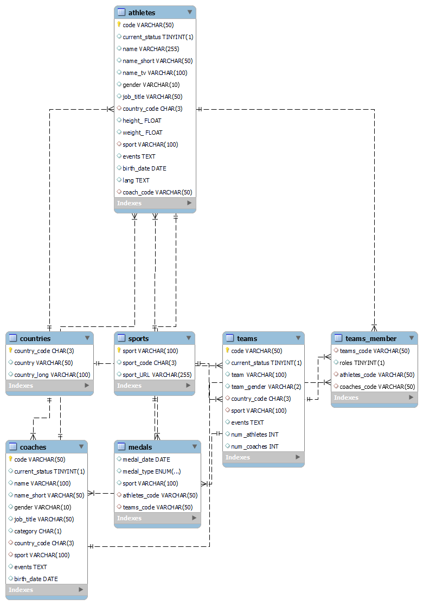

# Olympiadle

🎉 **Welcome to Olympiadle!** 🎉  
A Wordle-inspired web game where you challenge yourself to guess the athletes of the Olympic Games! 🏅

---

## 🏗️ Project Overview
This repository is a project created for the **BLG317E Database Systems** lecture. The aim of the homework was to design and implement a database system for a web-based game. We proudly present **Olympiadle**, where database systems meet gaming!

### Key Features:
- **Interactive Gameplay:** Guess the athletes in a fun and engaging way.
- **Dynamic Database Integration:** Built using a relational database system to manage athlete data.
- **Leaderboard Support:** Track scores and compare with friends!

---

## 📊 Database Design
The game is powered by a well-structured relational database. Below is the Entity-Relationship (ER) Diagram:

### Key Tables:
1. **Users** 
2. **Athletes** 
3. **Coaches** 
4. **Countries**
5. **Medals** 
6. **Sports**
7. **Teams**
8. **Teams&Members**

---

## 🚀 Getting Started
Follow these steps to set up Olympiadle on your local machine:

### Prerequisites:
- Python 3.8+
- A SQL database system (e.g., MySQL, PostgreSQL)

## 🎮 How to Play
1. Log in or create an account.
2. Start a new game session.
3. Guess the names of athletes based on the hints provided.
4. Earn points for each correct guess.
5. Check your position on the leaderboard!

---

## 🛠️ Technologies Used
- **Frontend:** HTML, CSS, JavaScript
- **Backend:** Python, Flask
- **Database:** SQL-based relational database (MySQL/PostgreSQL)

---

## 📬 Contact
For any questions or feedback, please feel free to reach out:
- **Emails:**
- guvenah22@itu.edu.tr
- mercank21@itu.edu.tr
- isler21@itu.edu.tr

---

🌟 **Enjoy playing Olympiadle and may the best athlete guesser win!** 🌟
